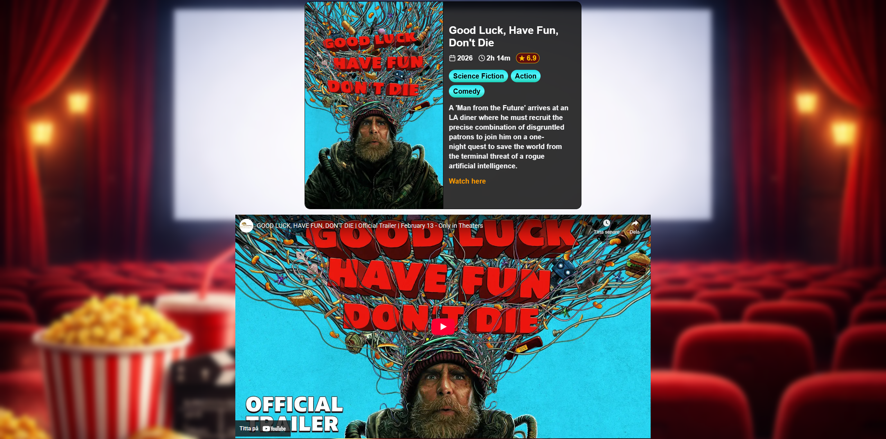
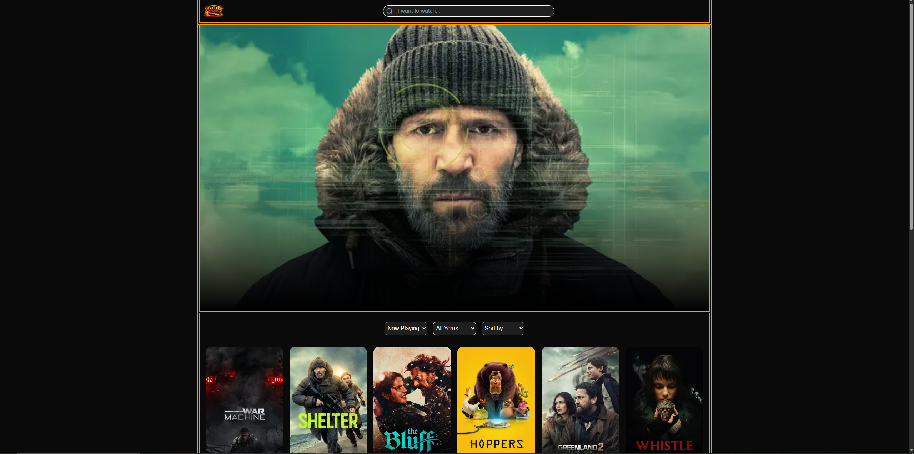
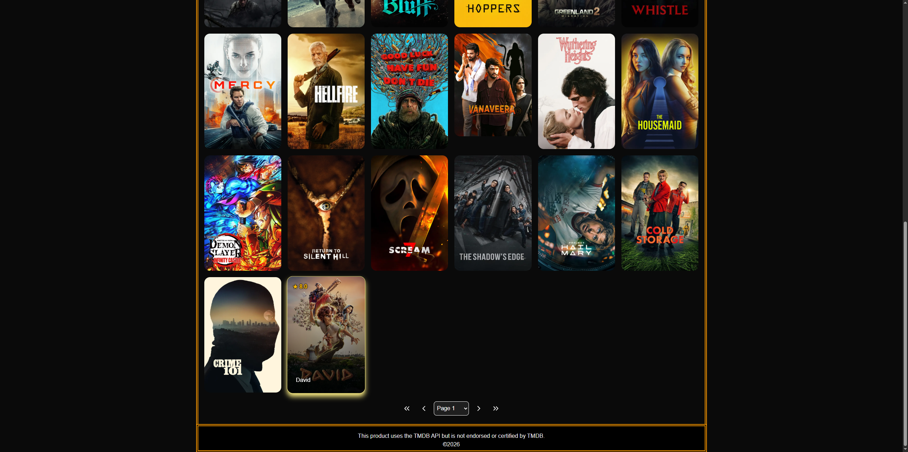

# Yvion

Explore the vast library of cinema and discover new and old favorites.

## 👨‍💻 Author

I'm Mattias Alm and I created this movie browser to help myself (and others hopefully) find the next contender for movie night.

## 🛠 Technologies

- Next.js
- Typescript
- Tailwind
- TMDB API (The Movie Database)

## ⚙️ Installation

```
# Clone repo
git clone https://github.com/Shinyn/yvion.git

# Enter project folder
cd yvion

# Install dependencies
npm install

# Run dev server
npm run dev
```

## ✨Functionality

- Search
- Filtering
- Sorting
- Pagination

## 🍳 Where to find the project

[Local version] http://localhost:3000/

[Live version] https://yvion.vercel.app/

## 📷 Gallery




